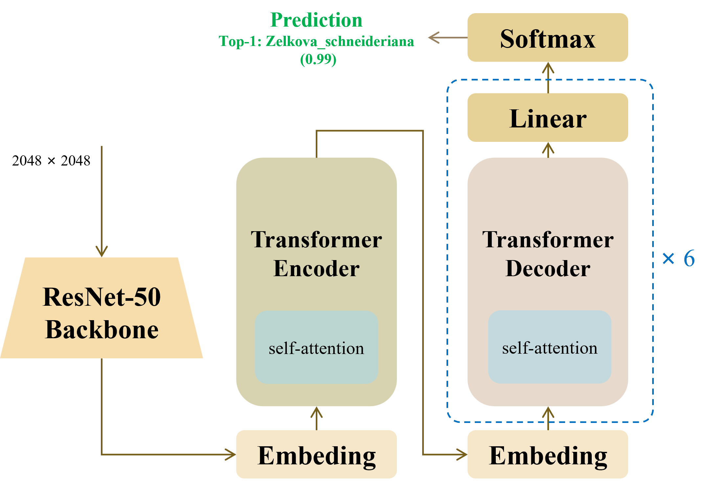
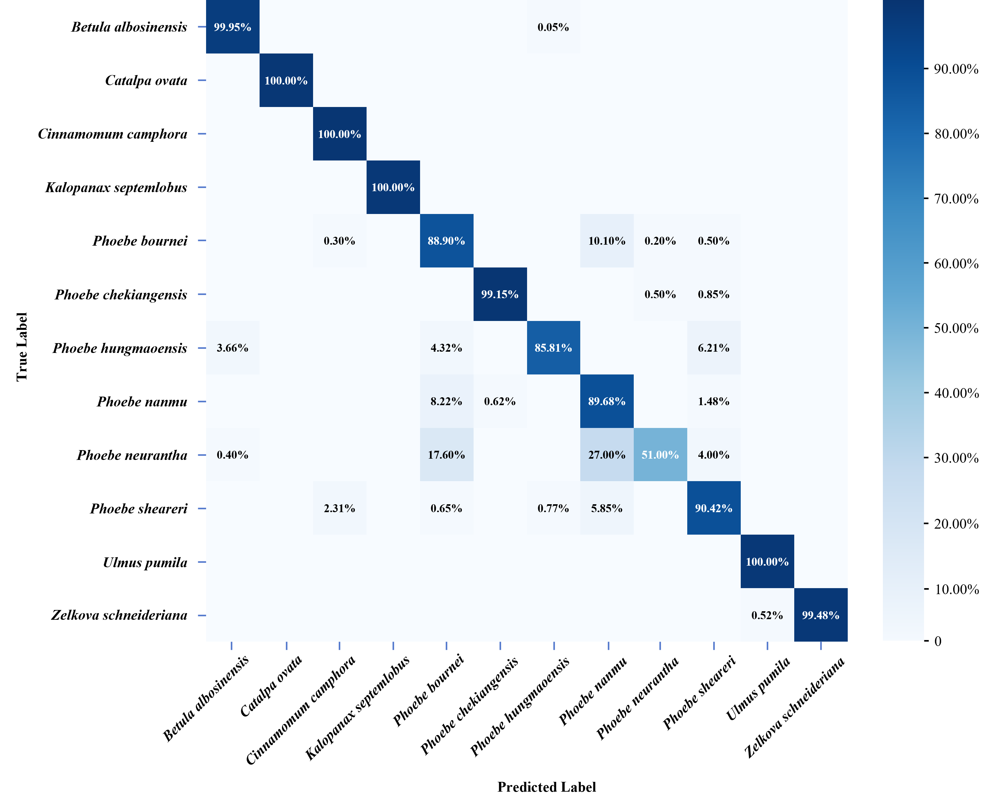
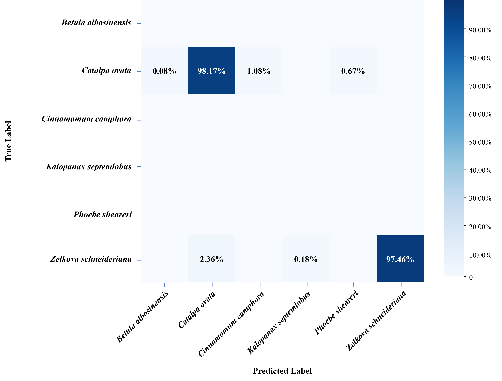

[//]: # (<p align="center">)

[//]: # ()
[//]: # (# A Deep Learning Approach for Species Identification of Archaeological Wood)

[//]: # ()
[//]: # ()

[//]: # ()
[//]: # (Figure 1. Overall architecture of our proposed model.)

[//]: # ()
[//]: # (</p>)
<div align="center">

# A Deep Learning Approach for Species Identification of Archaeological Wood


**Figure 1. Overall architecture of our proposed model.**

</div>

### Model Zoo

| Model |             train_dataloader:<br/>`img_folder`:             |                  train_dataloader:<br/>`ann_file`:                   |                      val_dataloader:<br/>`img_folder`:                      |          val_dataloader:<br/>`ann_file`:           |                                                                                                            checkpoint                                                                                                            |
| :---: |:-----------------------------------------------------------:|:------------------------------------------------------------------:|:---------------------------------------------------------------------------:|:------------------------------------------------:|:-----------------------------------------------------------------------------------------------------------------------------------------------------------------------------------------:|
no11-C90 |         data/iwood-mobile-archaeology-240614 (no11)         | data/annotations/manual/no11/train_all_no11_dim-10-16_manual.json |                             data/IWOOD_cleaned                              | data/annotations/manual/val_c13-90.dim-2048.json |                                         [Download](https://github.com/Linaikun77/iWood-pytorch/releases/download/v1.0.0/no11-C90-checkpoint.pth)                                     |
no11-benchmark |         data/iwood-mobile-archaeology-240614 (no11)         | data/annotations/manual/no11/train_no11_dim-10-16_manual.json |                 data/iwood-mobile-archaeology-240614 (n011)                 | data/annotations/manual/no11/test_no11_dim-10-16_manual.json |                         [Download](https://github.com/Linaikun77/iWood-pytorch/releases/download/v1.0.0/no11-benchmark-checkpoint.pth)                          |
binary-classifier | data/iwood-mobile-archaeology-240614 (only_catalpa_zelkova) | data/annotations/manual/binary_classifier/train_only_catalpa_zelkova.json | data/IWOOD_cleaned<br/>data/iWood-polished-20250413<br/>data/iWood-data-cut | data/annotations/manual/binary_classifier/val_c13-90.json<br/>data/annotations/manual/binary_classifier/val_polished.json<br/>data/annotations/manual/binary_classifier/val_cut.json |        [Download](https://github.com/Linaikun77/iWood-pytorch/releases/download/v1.0.0/checkpoint-bc.pth)                                                                 |


Notes:
- Please modify the parameters in the `configs/dataset/iwood_12.yml` and `iwood_bc.yml` file according to the table.
- **no11** -- indicates that the dataset does not contain the 11th category (Sassafras tzumu).
- **benchmark** -- indicates that the labeled dataset is split into 80% training set and 20% testing set. The benchmark dataset refers to `iwood-mobile-archaeology-240614`
- **C90** -- indicates that the entire benchmark dataset is used for training, while the `IWOOD_cleaned` dataset is used for testing.
- **For the binary-classifier model, the classification accuracy reported in the paper is the mean average precision evaluated across multiple confidence thresholds.**

### Results

<p align="center">


</p>

<p align="center">Figure 2. Confusion matrices on standard and archaeological wood image datasets.</p>

- Modify `output_dir` in `configs/iwood/iwood_r50vd_6x_coco.yml` to change the model output directory.
- *lease modify the definition of the `evaluate` function in `src/solver/det_engine.py`.

### Quick start

<details>
<summary>Install</summary>

```bash
conda create -n iwood python=3.11 pip
conda activate iwood
pip install -r requirements.txt
```

</details>


<details>
<summary>Data</summary>


```
--data/
  --annotations/                            # annotation json files.
  --iwood-mobile-archaeology-240614/        # all 12 categories of images (13 image categories without Sassafras tzumu).
  --IWOOD_cleaned/                          # the batch-1 dataset contains Catalpa ovata and Zelkova schneideriana.
  --iWood-polished-20250413/                # the batch-2 dataset for binary classification evaluation.
  --iWood-data-cut/                         # the batch-3 dataset for binary classification evaluation.
```
- Modify config [`img_folder`, `ann_file`](configs/dataset/iwood_12.yml)
</details>


<details>
<summary>Evaluation</summary>

- **Evaluation on Single GPU:**

Two evaluation methods are provided:
  - Use `./scripts/eval.sh` to evaluate on the dataset and output the confusion matrix.
  - Use `python eval.py` or `./eval.sh` to perform classification on a single image or a directory, which will output the classification results directly.
```shell
./scripts/eval.sh

./eval.sh
python eval.py --config path/to/.yml --image_dir path/to/image --resume path/to/.pth --output_dir path/to/output --print_output
```
--Please make sure to modify the `--config` , `--resume` and _output directory_ in the `eval.sh` file.

</details>


<details>
<summary>Export</summary>

```shell
python tools/export_onnx.py -c configs/iwood/iwood_r50vd_6x.yml -r path/to/checkpoint --check
```
</details>

### References
- **Related GitHub Repositories**
This project builds upon and draws inspiration from the following open-source repositories:
- [huggingface/pytorch-image-models](https://github.com/huggingface/pytorch-image-models) — consulted for recent advances in model design and implementation strategies.  
- [RT-DETR](https://github.com/lyuwenyu/RT-DETR/tree/main/rtdetr_pytorch) — utilized as the backbone network and partially adapted for code implementation.

- **Documentation**
  - [PyTorch Documentation](https://pytorch.org/docs/)
  - [OpenCV Documentation](https://docs.opencv.org/)
  - [scikit-learn Documentation](https://scikit-learn.org/stable/)


